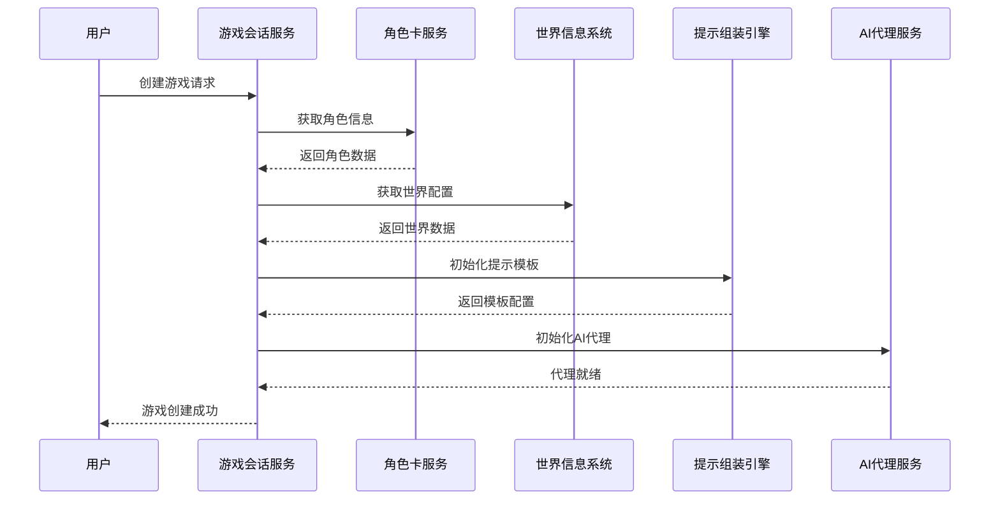
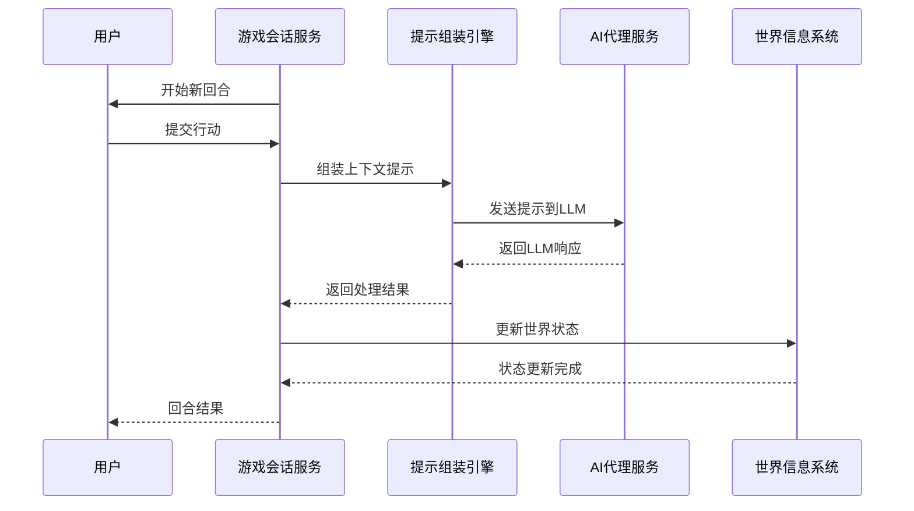

# Rhodes Resonance 系统架构设计方案

## 1. 现有项目架构分析

### 1.1 当前架构特点
- **架构模式**: 领域驱动设计(DDD) + 依赖注入
- **核心框架**: Agentscope (LLM Agent框架)
- **语言**: Python 3.11+
- **设计原则**: 严格遵循SOLID原则
- **当前状态**: 单体应用，命令行运行

### 1.2 现有模块结构
```
src/
├── domain/           # 领域层 - 业务核心
│   ├── models/       # 领域模型（角色、世界、战斗等）
│   ├── services/     # 领域服务
│   └── repositories/ # 仓储接口
├── application/      # 应用层 - 业务流程
│   ├── services/     # 应用服务
│   ├── coordinators/ # 协调器
│   ├── commands/     # 命令处理
│   └── queries/      # 查询处理
├── infrastructure/   # 基础设施层 - 技术实现
│   ├── repositories/ # 仓储实现
│   ├── logging/      # 日志实现
│   └── config/       # 配置管理
├── adapters/         # 适配器层
├── agents/           # AI代理
├── core/             # 核心接口和工具
└── world/            # 世界工具
```

### 1.3 现有技术栈
- **LLM集成**: Kimi API (OpenAI兼容接口)
- **配置管理**: JSON文件
- **日志系统**: 结构化JSONL + 文本日志
- **依赖注入**: 自研容器
- **事件系统**: 领域事件 + 事件总线

## 2. 整体系统架构设计

### 2.1 系统架构图

```
┌─────────────────────────────────────────────────────────────────┐
│                        前端层 (Frontend)                        │
├─────────────────────────────────────────────────────────────────┤
│  Web应用 (React/Vue)  │  移动端 (React Native)  │  管理后台      │
└─────────────────────────────────────────────────────────────────┘
                                │
                                ▼
┌─────────────────────────────────────────────────────────────────┐
│                      API网关层 (API Gateway)                     │
├─────────────────────────────────────────────────────────────────┤
│  路由转发  │  认证授权  │  限流控制  │  负载均衡  │  监控日志     │
└─────────────────────────────────────────────────────────────────┘
                                │
                                ▼
┌─────────────────────────────────────────────────────────────────┐
│                       微服务层 (Microservices)                   │
├─────────────────────────────────────────────────────────────────┤
│ 角色卡管理 │ 世界信息系统 │ 提示组装引擎 │ 游戏会话管理 │ 用户管理  │
│   服务     │     服务     │     服务     │     服务     │   服务    │
└─────────────────────────────────────────────────────────────────┘
                                │
                                ▼
┌─────────────────────────────────────────────────────────────────┐
│                     数据存储层 (Data Storage)                    │
├─────────────────────────────────────────────────────────────────┤
│  关系数据库  │  文档数据库  │  缓存数据库  │  对象存储  │  消息队列  │
│  (PostgreSQL)│ (MongoDB)   │   (Redis)   │   (S3)     │  (RabbitMQ) │
└─────────────────────────────────────────────────────────────────┘
                                │
                                ▼
┌─────────────────────────────────────────────────────────────────┐
│                     基础设施层 (Infrastructure)                   │
├─────────────────────────────────────────────────────────────────┤
│  容器编排  │  服务发现  │  配置中心  │  监控告警  │  日志收集     │
│ (K8s/Docker)│ (Consul)   │ (Apollo)   │ (Prometheus)│ (ELK Stack) │
└─────────────────────────────────────────────────────────────────┘
```

### 2.2 架构设计原则

#### 2.2.1 微服务架构
- **服务拆分**: 按业务领域拆分独立服务
- **独立部署**: 每个服务可独立开发、测试、部署
- **技术异构**: 不同服务可选择最适合的技术栈
- **故障隔离**: 单个服务故障不影响整体系统

#### 2.2.2 领域驱动设计(DDD)
- **保持现有DDD架构**: 继承现有项目的优秀设计
- **限界上下文**: 每个微服务对应一个限界上下文
- **聚合根设计**: 维护数据一致性和业务规则
- **领域事件**: 服务间异步通信

#### 2.2.3 云原生架构
- **容器化**: 所有服务容器化部署
- **弹性伸缩**: 根据负载自动扩缩容
- **高可用**: 多副本部署，故障自动转移
- **可观测性**: 完整的监控、日志、链路追踪

## 3. 技术栈选择和论证

### 3.1 前端技术栈

| 组件 | 技术选择 | 理由 |
|------|----------|------|
| 框架 | React 18 + TypeScript | 生态成熟，类型安全，社区活跃 |
| 状态管理 | Redux Toolkit + RTK Query | 标准化状态管理，内置缓存 |
| UI组件库 | Ant Design / Material-UI | 组件丰富，设计规范 |
| 路由 | React Router v6 | 声明式路由，代码分割 |
| 构建工具 | Vite | 快速开发体验，现代化构建 |
| 实时通信 | Socket.IO Client | 双向通信，自动重连 |
| 移动端 | React Native | 代码复用，跨平台 |

### 3.2 后端技术栈

| 组件 | 技术选择 | 理由 |
|------|----------|------|
| 主要语言 | Python 3.11+ | 保持技术栈一致性，AI生态丰富 |
| Web框架 | FastAPI | 高性能，自动API文档，类型提示 |
| 异步框架 | asyncio + uvloop | 高并发处理，性能优异 |
| 微服务框架 | Nameko | 轻量级，易集成DDD架构 |
| API网关 | Kong / Traefik | 功能丰富，插件生态 |
| LLM集成 | Agentscope + OpenAI API | 保持现有框架，支持多种模型 |

### 3.3 数据存储技术栈

| 存储类型 | 技术选择 | 理由 |
|----------|----------|------|
| 关系数据库 | PostgreSQL 14+ | ACID特性，JSON支持，扩展性好 |
| 文档数据库 | MongoDB 6.0+ | 灵活schema，适合配置和日志 |
| 缓存数据库 | Redis 7.0+ | 高性能，数据结构丰富 |
| 对象存储 | MinIO / AWS S3 | 非结构化数据，高可用 |
| 搜索引擎 | Elasticsearch 8.0+ | 全文搜索，实时分析 |
| 消息队列 | RabbitMQ / Apache Kafka | 可靠消息传递，高吞吐量 |

### 3.4 基础设施技术栈

| 组件 | 技术选择 | 理由 |
|------|----------|------|
| 容器化 | Docker + Docker Compose | 标准化部署，环境一致性 |
| 容器编排 | Kubernetes | 生产级编排，自动扩缩容 |
| 服务网格 | Istio (可选) | 流量管理，安全策略 |
| 配置中心 | Apollo / Consul | 集中配置管理，动态更新 |
| 服务发现 | Consul / etcd | 自动服务注册发现 |
| 监控系统 | Prometheus + Grafana | 时序数据库，可视化面板 |
| 日志系统 | ELK Stack (Elasticsearch + Logstash + Kibana) | 集中日志管理，全文搜索 |
| 链路追踪 | Jaeger / Zipkin | 分布式追踪，性能分析 |

## 4. 模块化设计方案

### 4.1 微服务拆分策略

#### 4.1.1 角色卡管理服务 (Character Service)
```python
# 职责
- 角色CRUD操作
- 角色属性管理
- 角色关系维护
- 角色状态跟踪

# 技术栈
- FastAPI + SQLAlchemy
- PostgreSQL
- Redis缓存
```

#### 4.1.2 世界信息系统 (World Service)
```python
# 职责
- 世界配置管理
- 场景信息维护
- 地点关系管理
- 世界状态同步

# 技术栈
- FastAPI + MongoDB
- Redis缓存
- Elasticsearch搜索
```

#### 4.1.3 提示组装引擎 (Prompt Service)
```python
# 职责
- 提示模板管理
- 动态提示生成
- 上下文组装
- 提示优化

# 技术栈
- FastAPI + Jinja2
- Redis缓存
- 模板版本控制
```

#### 4.1.4 游戏会话管理 (Game Session Service)
```python
# 职责
- 游戏会话创建/管理
- 回合制逻辑控制
- 玩家状态同步
- 游戏事件处理

# 技术栈
- FastAPI + WebSocket
- Redis + PostgreSQL
- 事件驱动架构
```

#### 4.1.5 用户管理服务 (User Service)
```python
# 职责
- 用户认证授权
- 用户信息管理
- 权限控制
- 会话管理

# 技术栈
- FastAPI + OAuth2
- PostgreSQL
- JWT Token
```

#### 4.1.6 AI代理服务 (Agent Service)
```python
# 职责
- LLM代理管理
- 模型调用接口
- 响应处理
- 代理状态管理

# 技术栈
- Agentscope + FastAPI
- 支持多种LLM API
- 异步处理
```

### 4.2 服务间通信设计

#### 4.2.1 同步通信 - REST API
```python
# 适用场景
- 用户查询操作
- 实时数据获取
- 配置信息读取

# 技术实现
- FastAPI自动生成OpenAPI文档
- 请求/响应DTO标准化
- 统一错误处理
```

#### 4.2.2 异步通信 - 消息队列
```python
# 适用场景
- 游戏事件通知
- 数据同步更新
- 长时间任务处理

# 技术实现
- RabbitMQ消息队列
- 事件驱动架构
- 消息持久化
```

#### 4.2.3 实时通信 - WebSocket
```python
# 适用场景
- 游戏实时交互
- 状态变更通知
- 多人协作

# 技术实现
- Socket.IO
- 房间管理
- 消息广播
```

## 5. 数据流设计

### 5.1 核心业务流程

#### 5.1.1 游戏创建流程


#### 5.1.2 游戏回合流程


### 5.2 数据存储策略

#### 5.2.1 数据分片策略
```python
# 角色数据
- 按用户ID分片
- 热点数据缓存
- 读写分离

# 游戏会话数据
- 按会话ID分片
- 内存优先
- 定期持久化

# 世界配置数据
- 多副本部署
- 版本控制
- 灰度发布
```

#### 5.2.2 缓存策略
```python
# 多级缓存
L1: 应用内存缓存 (热点数据)
L2: Redis分布式缓存 (共享数据)
L3: 数据库查询缓存

# 缓存策略
- 写入时更新 (Write-through)
- 定时刷新 (Time-based expiration)
- 事件驱动更新 (Event-driven invalidation)
```

## 6. API设计规范

### 6.1 RESTful API设计

#### 6.1.1 URL设计规范
```
# 资源命名规范
GET    /api/v1/characters          # 获取角色列表
POST   /api/v1/characters          # 创建新角色
GET    /api/v1/characters/{id}     # 获取特定角色
PUT    /api/v1/characters/{id}     # 更新角色信息
DELETE /api/v1/characters/{id}     # 删除角色

# 嵌套资源
GET    /api/v1/characters/{id}/relationships  # 获取角色关系
POST   /api/v1/characters/{id}/relationships  # 创建角色关系

# 查询参数
GET    /api/v1/characters?page=1&size=20&sort=name  # 分页查询
GET    /api/v1/characters?filter=type:npc            # 过滤查询
```

#### 6.1.2 请求/响应格式
```json
// 标准请求格式
{
  "data": {
    "name": "Amiya",
    "type": "npc",
    "persona": "罗德岛公开领导人阿米娅..."
  },
  "metadata": {
    "version": "1.0",
    "timestamp": "2024-01-01T00:00:00Z"
  }
}

// 标准响应格式
{
  "success": true,
  "data": {
    "id": "char_001",
    "name": "Amiya",
    "created_at": "2024-01-01T00:00:00Z"
  },
  "message": "角色创建成功",
  "metadata": {
    "request_id": "req_123456",
    "timestamp": "2024-01-01T00:00:01Z"
  }
}

// 错误响应格式
{
  "success": false,
  "error": {
    "code": "VALIDATION_ERROR",
    "message": "角色名称不能为空",
    "details": {
      "field": "name",
      "constraint": "required"
    }
  },
  "metadata": {
    "request_id": "req_123456",
    "timestamp": "2024-01-01T00:00:01Z"
  }
}
```

### 6.2 WebSocket API设计

#### 6.2.1 事件类型定义
```typescript
// 游戏事件类型
enum GameEventType {
  GAME_STARTED = 'game_started',
  GAME_ENDED = 'game_ended',
  ROUND_STARTED = 'round_started',
  ROUND_ENDED = 'round_ended',
  CHARACTER_ACTION = 'character_action',
  WORLD_STATE_CHANGED = 'world_state_changed'
}

// 事件消息格式
interface GameEvent {
  type: GameEventType;
  payload: any;
  timestamp: string;
  gameId: string;
  userId?: string;
}
```

#### 6.2.2 房间管理
```typescript
// 房间操作
interface RoomManager {
  // 加入游戏房间
  joinRoom(gameId: string, userId: string): Promise<void>;
  
  // 离开游戏房间
  leaveRoom(gameId: string, userId: string): Promise<void>;
  
  // 发送消息到房间
  sendToRoom(gameId: string, event: GameEvent): Promise<void>;
  
  // 发送私聊消息
  sendToUser(userId: string, event: GameEvent): Promise<void>;
}
```

### 6.3 API安全设计

#### 6.3.1 认证授权
```python
# JWT Token认证
- 访问令牌 (Access Token): 15分钟有效期
- 刷新令牌 (Refresh Token): 7天有效期
- 令牌自动续期机制

# OAuth2.0授权
- 支持第三方登录 (Google, GitHub, etc.)
- 角色基础权限控制 (RBAC)
- API密钥管理 (用于服务间调用)
```

#### 6.3.2 限流控制
```python
# 用户级限流
- 普通用户: 100请求/分钟
- VIP用户: 500请求/分钟
- 管理员: 1000请求/分钟

# API级限流
- 查询接口: 1000请求/分钟
- 创建接口: 100请求/分钟
- 更新接口: 200请求/分钟
- 删除接口: 50请求/分钟
```

## 7. 扩展性设计

### 7.1 "创世引擎"扩展设计

#### 7.1.1 创世引擎架构
```
┌─────────────────────────────────────────────────────────────────┐
│                     创世引擎 (Genesis Engine)                    │
├─────────────────────────────────────────────────────────────────┤
│  世界生成器  │  角色生成器  │  剧情生成器  │  任务生成器  │  规则引擎  │
└─────────────────────────────────────────────────────────────────┘
                                │
                                ▼
┌─────────────────────────────────────────────────────────────────┐
│                       AI模型集成层                               │
├─────────────────────────────────────────────────────────────────┤
│  GPT-4  │  Claude  │  本地模型  │  图像生成  │  语音合成     │
└─────────────────────────────────────────────────────────────────┘
```

#### 7.1.2 核心功能模块
```python
# 世界生成器
class WorldGenerator:
    """程序化世界生成"""
    - 地形生成算法
    - 生态分布系统
    - 文明分布逻辑
    - 历史事件生成

# 角色生成器
class CharacterGenerator:
    """AI驱动的角色生成"""
    - 性格特征生成
    - 背景故事创作
    - 外观描述生成
    - 能力值平衡

# 剧情生成器
class PlotGenerator:
    """动态剧情生成"""
    - 故事结构模板
    - 冲突事件生成
    - 角色关系网络
    - 剧情分支逻辑
```

### 7.2 多人游戏扩展设计

#### 7.2.1 多人游戏架构
```
┌─────────────────────────────────────────────────────────────────┐
│                       多人游戏大厅                               │
├─────────────────────────────────────────────────────────────────┤
│  房间管理  │  匹配系统  │  好友系统  │  排行榜  │  聊天系统     │
└─────────────────────────────────────────────────────────────────┘
                                │
                                ▼
┌─────────────────────────────────────────────────────────────────┐
│                       游戏房间实例                               │
├─────────────────────────────────────────────────────────────────┤
│  状态同步  │  事件广播  │  冲突解决  │  断线重连  │  观战模式     │
└─────────────────────────────────────────────────────────────────┘
```

#### 7.2.2 核心技术实现
```python
# 状态同步机制
class StateSynchronizer:
    """游戏状态同步"""
    - 增量状态更新
    - 状态快照管理
    - 冲突检测解决
    - 网络补偿算法

# 匹配算法
class MatchMakingSystem:
    """智能匹配系统"""
    - ELO评分匹配
    - 角色平衡匹配
    - 延迟优化匹配
    - 好友优先匹配
```

### 7.3 水平扩展设计

#### 7.3.1 数据库扩展
```python
# 读写分离
- 主库处理写操作
- 多个从库处理读操作
- 自动故障转移

# 分库分表
- 按用户ID水平分片
- 按时间范围垂直分片
- 跨分片查询优化

# 数据归档
- 冷数据自动归档
- 历史数据压缩存储
- 快速恢复机制
```

#### 7.3.2 服务扩展
```python
# 无状态服务设计
- 会话外部存储
- 状态服务分离
- 负载均衡策略

# 弹性伸缩
- CPU/内存指标监控
- 自动扩缩容策略
- 预热和冷却机制
```

## 8. 部署架构策略

### 8.1 云服务部署架构

#### 8.1.1 云平台选择
```
# 推荐云平台组合
- 计算服务: AWS EC2 / 阿里云ECS
- 容器服务: AWS EKS / 阿里云ACK
- 数据库服务: AWS RDS / 阿里云RDS
- 缓存服务: AWS ElastiCache / 阿里云Redis
- 存储服务: AWS S3 / 阿里云OSS
- CDN服务: AWS CloudFront / 阿里云CDN
```

#### 8.1.2 环境划分
```
# 开发环境 (Development)
- 单节点部署
- 最小资源配置
- 快速迭代开发

# 测试环境 (Testing)
- 多节点集群
- 性能压力测试
- 集成测试验证

# 预发布环境 (Staging)
- 生产环境镜像
- 完整功能验证
- 性能基准测试

# 生产环境 (Production)
- 高可用集群
- 自动故障转移
- 监控告警完整
```

### 8.2 容器化部署

#### 8.2.1 Docker镜像设计
```dockerfile
# 基础镜像
FROM python:3.11-slim

# 多阶段构建
# 构建阶段
FROM builder as build-stage
COPY requirements.txt .
RUN pip install --no-cache-dir -r requirements.txt

# 运行阶段
FROM python:3.11-slim as runtime-stage
COPY --from=build-stage /usr/local/lib/python3.11/site-packages /usr/local/lib/python3.11/site-packages
COPY . /app
WORKDIR /app
CMD ["uvicorn", "main:app", "--host", "0.0.0.0", "--port", "8000"]
```

#### 8.2.2 Kubernetes部署配置
```yaml
# 服务部署示例
apiVersion: apps/v1
kind: Deployment
metadata:
  name: character-service
spec:
  replicas: 3
  selector:
    matchLabels:
      app: character-service
  template:
    metadata:
      labels:
        app: character-service
    spec:
      containers:
      - name: character-service
        image: rhodes-resonance/character-service:latest
        ports:
        - containerPort: 8000
        env:
        - name: DATABASE_URL
          valueFrom:
            secretKeyRef:
              name: db-secret
              key: url
        resources:
          requests:
            memory: "256Mi"
            cpu: "250m"
          limits:
            memory: "512Mi"
            cpu: "500m"
```

### 8.3 CI/CD流水线

#### 8.3.1 持续集成流程
```yaml
# GitHub Actions示例
name: CI/CD Pipeline

on:
  push:
    branches: [main, develop]
  pull_request:
    branches: [main]

jobs:
  test:
    runs-on: ubuntu-latest
    steps:
    - uses: actions/checkout@v3
    - name: Set up Python
      uses: actions/setup-python@v4
      with:
        python-version: '3.11'
    - name: Install dependencies
      run: |
        pip install -r requirements.txt
        pip install -r requirements-dev.txt
    - name: Run tests
      run: pytest --cov=src tests/
    - name: Code quality check
      run: |
        ruff check src/
        mypy src/

  build:
    needs: test
    runs-on: ubuntu-latest
    steps:
    - uses: actions/checkout@v3
    - name: Build Docker image
      run: |
        docker build -t rhodes-resonance/api:${{ github.sha }} .
        docker push rhodes-resonance/api:${{ github.sha }}

  deploy:
    needs: build
    runs-on: ubuntu-latest
    if: github.ref == 'refs/heads/main'
    steps:
    - name: Deploy to production
      run: |
        kubectl set image deployment/api api=rhodes-resonance/api:${{ github.sha }}
```

### 8.4 监控和运维

#### 8.4.1 监控指标体系
```python
# 业务指标
- 在线用户数
- 游戏会话数
- API响应时间
- 错误率统计

# 系统指标
- CPU使用率
- 内存使用率
- 磁盘I/O
- 网络流量

# 应用指标
- 请求QPS
- 数据库连接数
- 缓存命中率
- 消息队列积压
```

#### 8.4.2 告警策略
```python
# 告警级别
- P0: 系统不可用 (立即通知)
- P1: 核心功能异常 (5分钟内通知)
- P2: 性能下降 (15分钟内通知)
- P3: 潜在风险 (1小时内通知)

# 通知渠道
- 短信通知 (P0级别)
- 电话通知 (P0级别)
- 邮件通知 (P1-P2级别)
- 钉钉/Slack (P3级别)
```

## 9. 实施路线图

### 9.1 第一阶段：基础架构搭建 (1-2个月)

#### 9.1.1 核心服务开发
```
Week 1-2: 项目初始化
- 代码仓库搭建
- CI/CD流水线配置
- 开发环境部署
- 基础框架搭建

Week 3-4: 用户管理服务
- 用户注册/登录
- JWT认证系统
- 权限管理
- API文档生成

Week 5-6: 角色卡管理服务
- 角色CRUD接口
- 角色属性管理
- 数据库设计和迁移
- 缓存层实现

Week 7-8: 基础前端开发
- 项目脚手架搭建
- 用户界面组件
- 路由和状态管理
- API集成
```

#### 9.1.2 基础设施搭建
```
Week 1-2: 云服务准备
- 云账号和权限配置
- 基础网络环境搭建
- 安全组策略配置
- 域名和SSL证书

Week 3-4: 容器化部署
- Docker镜像构建
- Kubernetes集群搭建
- 基础监控部署
- 日志收集系统

Week 5-6: 数据库部署
- PostgreSQL集群部署
- Redis集群部署
- 数据备份策略
- 监控告警配置
```

### 9.2 第二阶段：核心功能实现 (2-3个月)

#### 9.2.1 游戏核心服务
```
Week 9-10: 世界信息系统
- 世界配置管理
- 场景信息维护
- 地点关系管理
- 搜索功能实现

Week 11-12: 提示组装引擎
- 提示模板系统
- 上下文组装逻辑
- 模板版本管理
- 性能优化

Week 13-14: AI代理服务
- Agentscope集成
- 多模型支持
- 异步处理机制
- 错误重试机制

Week 15-16: 游戏会话管理
- 游戏创建和加入
- 回合制逻辑实现
- WebSocket实时通信
- 状态同步机制
```

#### 9.2.2 前端功能完善
```
Week 9-10: 游戏界面开发
- 游戏大厅界面
- 角色选择界面
- 游戏设置界面
- 实时聊天组件

Week 11-12: 游戏交互功能
- 角色行动界面
- 游戏状态显示
- 历史记录查看
- 多人协作功能

Week 13-14: 用户体验优化
- 响应式设计
- 性能优化
- 错误处理
- 加载状态管理

Week 15-16: 移动端适配
- React Native开发
- 跨平台兼容
- 推送通知
- 离线功能
```

### 9.3 第三阶段：高级功能开发 (2-3个月)

#### 9.3.1 扩展功能实现
```
Week 17-20: 创世引擎开发
- 世界生成算法
- AI角色生成
- 剧情生成系统
- 任务生成器

Week 21-24: 多人游戏功能
- 匹配系统开发
- 房间管理功能
- 观战模式实现
- 排行榜系统

Week 25-26: 社交功能
- 好友系统
- 公会系统
- 聊天系统
- 分享功能
```

#### 9.3.2 性能优化和扩展
```
Week 17-20: 性能优化
- 数据库查询优化
- 缓存策略优化
- API响应时间优化
- 前端加载优化

Week 21-24: 扩展性改进
- 服务拆分优化
- 负载均衡配置
- 自动扩缩容
- 灾难恢复

Week 25-26: 安全加固
- 安全漏洞扫描
- 数据加密
- 访问控制优化
- 安全审计
```

### 9.4 第四阶段：上线和运营 (1个月)

#### 9.4.1 上线准备
```
Week 27-28: 生产环境部署
- 生产环境配置
- 数据迁移
- 性能压测
- 安全测试

Week 29-30: 运营准备
- 运维文档编写
- 监控告警配置
- 备份恢复测试
- 应急预案制定
```

#### 9.4.2 持续迭代
```
# 上线后迭代计划
- 用户反馈收集和处理
- 性能监控和优化
- 新功能持续开发
- 技术债务清理
```

## 10. 关键接口设计

### 10.1 角色卡管理接口

#### 10.1.1 角色CRUD接口
```python
# 角色创建接口
POST /api/v1/characters
{
  "name": "string",
  "type": "player|npc",
  "persona": "string",
  "appearance": "string",
  "abilities": {
    "STR": "int",
    "DEX": "int",
    "CON": "int",
    "INT": "int",
    "WIS": "int",
    "CHA": "int"
  },
  "skills": ["string"],
  "equipment": ["string"]
}

# 角色查询接口
GET /api/v1/characters/{character_id}
Response:
{
  "id": "string",
  "name": "string",
  "type": "player|npc",
  "level": "int",
  "hp": "int",
  "max_hp": "int",
  "abilities": {...},
  "skills": [...],
  "equipment": [...],
  "created_at": "datetime",
  "updated_at": "datetime"
}
```

#### 10.1.2 角色关系接口
```python
# 创建角色关系
POST /api/v1/characters/{character_id}/relationships
{
  "target_character_id": "string",
  "relationship_type": "friend|enemy|neutral",
  "strength": "int(0-100)",
  "description": "string"
}

# 查询角色关系网络
GET /api/v1/characters/{character_id}/relationships?depth=int
Response:
{
  "character_id": "string",
  "relationships": [
    {
      "target_character_id": "string",
      "target_name": "string",
      "relationship_type": "string",
      "strength": "int",
      "description": "string"
    }
  ]
}
```

### 10.2 世界信息系统接口

#### 10.2.1 世界配置接口
```python
# 创建世界
POST /api/v1/worlds
{
  "name": "string",
  "description": "string",
  "settings": {
    "time_system": "boolean",
    "weather_system": "boolean",
    "combat_system": "boolean"
  },
  "locations": [
    {
      "name": "string",
      "description": "string",
      "type": "indoor|outdoor|dungeon",
      "coordinates": {"x": "int", "y": "int"}
    }
  ]
}

# 获取世界状态
GET /api/v1/worlds/{world_id}/state
Response:
{
  "world_id": "string",
  "current_time": {
    "day": "int",
    "hour": "int",
    "minute": "int"
  },
  "weather": "string",
  "current_location": "string",
  "characters": ["string"],
  "active_events": [...]
}
```

#### 10.2.2 场景管理接口
```python
# 创建场景
POST /api/v1/worlds/{world_id}/scenes
{
  "name": "string",
  "description": "string",
  "location_id": "string",
  "weather": "string",
  "atmosphere": "string",
  "details": ["string"],
  "background_events": ["string"],
  "tension_level": "int(0-5)"
}

# 更新场景状态
PUT /api/v1/worlds/{world_id}/scenes/{scene_id}
{
  "weather": "string",
  "atmosphere": "string",
  "details": ["string"],
  "tension_level": "int"
}
```

### 10.3 游戏会话接口

#### 10.3.1 游戏管理接口
```python
# 创建游戏会话
POST /api/v1/games
{
  "name": "string",
  "world_id": "string",
  "max_players": "int",
  "game_mode": "story|combat|sandbox",
  "settings": {
    "auto_advance": "boolean",
    "max_rounds": "int",
    "time_limit": "int"
  },
  "characters": ["string"]
}

# 加入游戏
POST /api/v1/games/{game_id}/join
{
  "character_id": "string",
  "player_id": "string"
}

# 开始游戏
POST /api/v1/games/{game_id}/start
```

#### 10.3.2 游戏交互接口
```python
# 提交行动
POST /api/v1/games/{game_id}/actions
{
  "character_id": "string",
  "action": {
    "type": "talk|move|attack|use_item|skill_check",
    "target": "string",
    "content": "string",
    "parameters": {...}
  }
}

# 获取游戏状态
GET /api/v1/games/{game_id}/state
Response:
{
  "game_id": "string",
  "status": "waiting|active|paused|ended",
  "current_round": "int",
  "current_turn": "string",
  "characters": [
    {
      "id": "string",
      "name": "string",
      "hp": "int",
      "position": {"x": "int", "y": "int"},
      "status": "active|inactive|dead"
    }
  ],
  "world_state": {...},
  "last_actions": [...]
}
```

### 10.4 AI代理接口

#### 10.4.1 代理管理接口
```python
# 创建AI代理
POST /api/v1/agents
{
  "name": "string",
  "character_id": "string",
  "model_config": {
    "provider": "openai|anthropic|local",
    "model_name": "string",
    "temperature": "float",
    "max_tokens": "int"
  },
  "prompt_template": "string",
  "tools": ["string"]
}

# 获取代理响应
POST /api/v1/agents/{agent_id}/generate
{
  "context": {
    "game_state": {...},
    "message_history": [...],
    "current_situation": "string"
  },
  "prompt_overrides": {...}
}
Response:
{
  "response": "string",
  "intent": {
    "type": "string",
    "target": "string",
    "parameters": {...}
  },
  "confidence": "float",
  "metadata": {...}
}
```

#### 10.4.2 提示管理接口
```python
# 创建提示模板
POST /api/v1/prompts
{
  "name": "string",
  "description": "string",
  "template": "string",
  "variables": ["string"],
  "version": "string",
  "category": "character|world|action|system"
}

# 组装提示
POST /api/v1/prompts/{prompt_id}/assemble
{
  "variables": {
    "character_name": "string",
    "situation": "string",
    "context": {...}
  },
  "options": {
    "include_history": "boolean",
    "history_limit": "int",
    "format": "json|text"
  }
}
```

## 总结

本架构设计方案基于现有项目的优秀DDD架构，结合现代微服务架构和云原生技术，为rhodes_resonance项目提供了一个可扩展、高可用的技术架构。

### 核心优势

1. **架构清晰**: 严格遵循DDD原则，保持现有项目的优秀设计
2. **技术先进**: 采用现代化技术栈，支持高并发和大规模用户
3. **扩展性强**: 微服务架构支持独立扩展和快速迭代
4. **部署灵活**: 云原生部署，支持多种部署策略
5. **运维完善**: 完整的监控、日志、告警体系

### 实施建议

1. **分阶段实施**: 按照路线图逐步实施，降低风险
2. **技术验证**: 关键技术点先进行原型验证
3. **团队培训**: 确保团队掌握新技术栈
4. **持续优化**: 根据实际运行情况持续优化架构

这个架构设计能够支持rhodes_resonance项目从当前的单体应用演进为支持100-500并发用户的云原生系统，并为未来的"创世引擎"和"多人游戏"功能提供了坚实的技术基础。